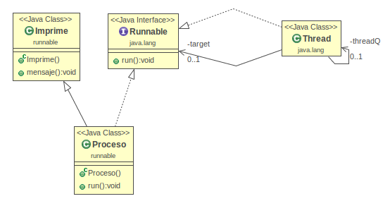

# Tutorial para el manejo de la interfaz Runnable

Para hablar primero de la interfaz runnable necesitamos hablar acerca un
poco de los hilos

## Que son los hilos?
En general, los hilos son procesos que se ejecutan cuando el usuario o
la aplicacion los active, por ejemplo para hacer un reloj, para crear
servicios en segundo plano, etc.

Sabes que ya estas implementando un hilo en el momento que corres que
una aplicacion? Si, por defecto Java incorpora el hilo principal para
manejar las actividades o acciones principales de apliaccion.

#### Hay Ventajas?
- Si, te permite ejecutar hilos en paralelo
- Puedes modelar acciones de forma no secuencial
- Multiprocesamiento

## Porque es conveniente implementar la interfaz Runnable y no heredar de la clase Thread?
A veces no es conveniente extender la clase Thread porque se pierde la
posibilidad de extender otro objeto. Es una de las razones por que
existe la interfaz Runnable que declara nada más que el método public
void run() y que se puede usar fácilmente para crear hilos.

Por ejemplo se crea esta clase `Reloj` 
```
public class Reloj {
    private int hora;
    private int min;
    private int seg;
    //Siguiente codigo
}
```

Despues se crea otra clase hija de `Reloj` 
``` 
public class RelojBonito extends Reloj, Thread {
    private int color;
    private int tipo;
    //Siguiente codigo
}
```

Erroneamente no puedes hacer lo siguiente, NO se permite la herencia
multiple
```
public class RelojBonito extends Reloj, Runnable {
    private int color;
    private int tipo;
    //Siguiente codigo
}
```

Para este caso, lo mejor seria: implementar la interfaz `Runnable`, con
esta interfaz forzas a que la clase se comporte como un hilo y tenga las
propiedades del padre.

```
public class RelojBonito extends Reloj implements Runnable {
    private int color;
    private int tipo;

    /**
     * When an object implementing interface <code>Runnable</code> is used
     * to create a thread, starting the thread causes the object's
     * <code>run</code> method to be called in that separately executing
     * thread.
     * <p>
     * The general contract of the method <code>run</code> is that it may
     * take any action whatsoever.
     *
     * @see Thread#run()
     */
    @Override
    public void run() {
        //Codigo que se ejecutara cuando el hilo comience
    }

}
```

La interfaz `Runnable` exige solamente el método `run()`, sin embargo,
normalmente se implementan más métodos para crear un hilo que este hilo
debe cumplir.

## Otro ejemplo
 Aquí tenemos primero una clase Imprime
que imprime un mensaje. 
```
public class Imprime {
    public void mensaje(){
        System.out.println("Hola este es un mensaje");
    }
}
```
Luego implementamos el hilo pero como interfaz Runnable. 
```
public class Proceso extends Imprime implements Runnable {
    @Override
    public void run() {
        this.mensaje();
    }
}
```

Finalmente si quisiéramos probar nuestro hilo tendríamos que utilizar
`run()` en vez de `start()`
```
public class Main {
    public static void main(String[] args) {
        Proceso proceso = new Proceso();
        proceso.run();
    }
}
```

[Codigo fuente](main/src)

>Implementa `Runnable` si quieres hacer que una clase tenga la
>propiedas de un hilo, sin la necesidad de heredar de clase `Thread`

